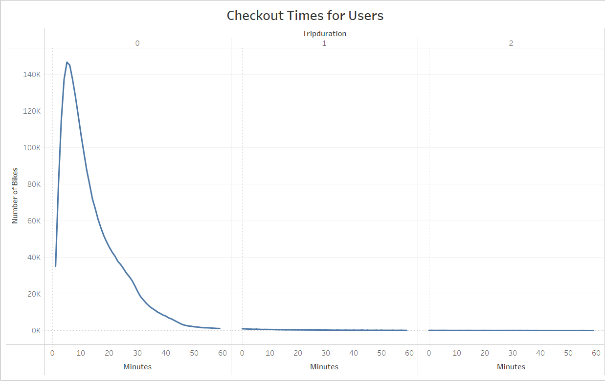
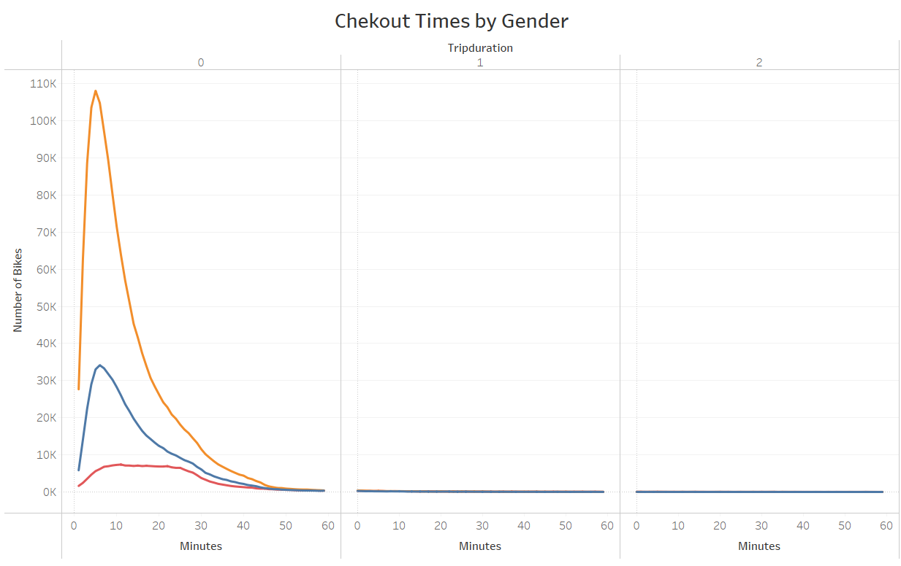
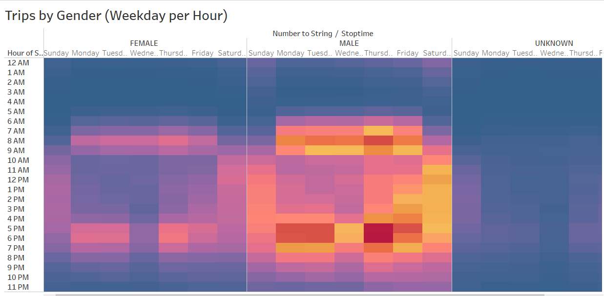
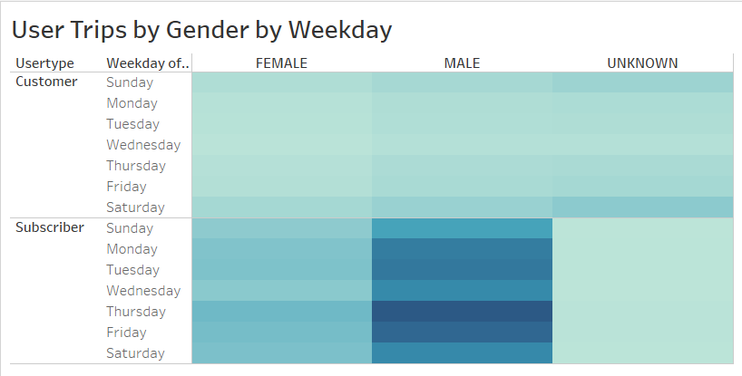
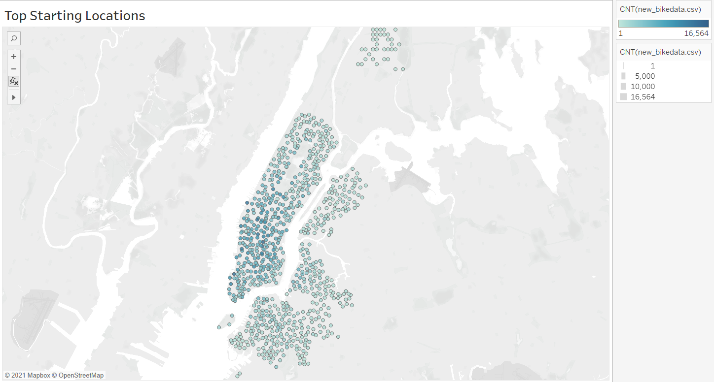
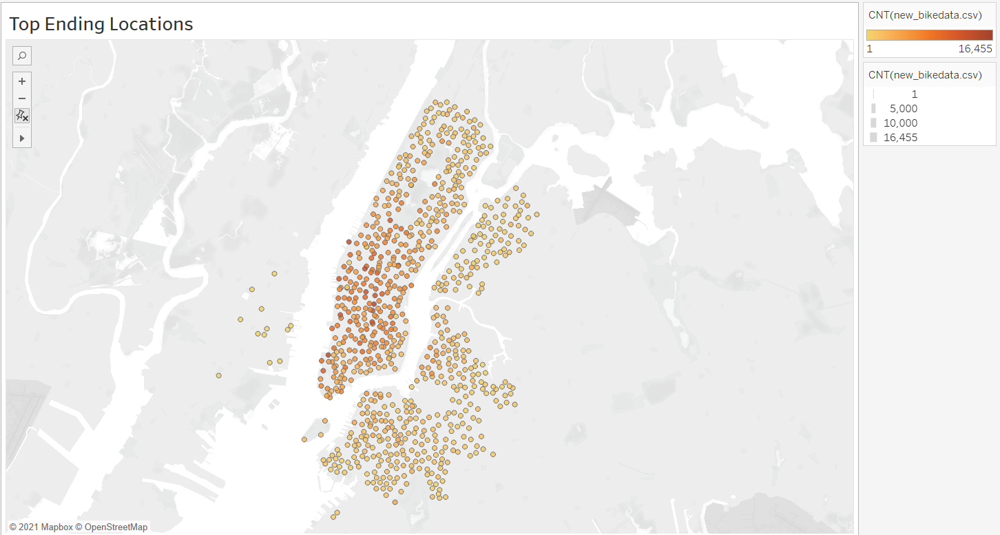

# Getting Des Moines Bikesharing
In a recent trip to New York we participated in their bikesharing program, powered by Citi, it was such a great experience that we wanted to see if this business model would be viable in Des Moines, IA. Most people believe Des Moines being just farmers and empty space but our thriving city of under 700,000 people would greatly benefit from a program like this to cut greenhouse emitions and get people moving more. Without having to purchase a bike of their own, Des Moisners would be able to pick up a bike in their closes kiosk and be able to drop it off at the closes station to their destination. Same as in New York City. 

We understand therer are other logistics to take into consideration but first we wanted to see how weel this program has worked for the city of New York. In reviewing their data for one summer month, August 2019, we could see how popular this program is with over 2.3 million users in one month alone. This analysis will review their use of the bicycle program, how long was the equipment rented for and how often. Also, we'll review if there was a difference between male and female riders, for those that identified as such. Finally we will see how far these bikes went from their original renting spot to their destinations. 

## Who is riding in New York City  
The information that was gathered was for the month of August in 2019 from Citibike, we did some conversions to deliver information more comprehensively but otherwise no other information was altered. Also to keep in mind is that NYC is about 5x larger than Des Moines, IA is and we will need to scale back our numbers as we proceed with this project. From the information provided in the month of August there were over 2.3 million users of the bicycle program. The overall trend that we saw was that most used it for the first hour and then returned it to a designated stations.

The way the program is set up it allows for the user to check out the bike in one location and drop it off in a station close to their destination, the client doesn't need to check out the bike all day but only the time they need to get from one place to the next. This is why we only see our users using the bike for the first hours.

We also checked if there were differences in gender, so men use the bike longer than women or vice versa?

Although there is a higher concentration on men or people that identify male, they only check out the equipment for the first hour. However this is not indicative that there are more males using the bikes. It could be males paying for their female friends or family members. It would still be wise to order the same amount of womens bicycles to mens.

We also analyzed the peak times of use, although NYC has a higher concentration of tourist around the city it was obvious that the bikes were used for peak hours of morning and evening rush hours.  There is more use of the bikes in the mornings form 6am to 9am and in the evenings from 4p to about 8p, Monday through Friday, this is due to people going into and out of their employments.

In this image we can also see that there is steady use of the bikes on weekends, which means that they is a steady use during weekend days. Is this something we can also expect in Des Moines, possibly if they're located around parks, museums, and commercial and restaurant areas. 

We tried to see if there was a difference in women and mens use of the bikes throughout the week and there wasn't much from the larger set of data. 

### How does this program make money???

The program has two ways to participate, as a subscriber and as a customer or one time user. The subscriber will pay a monthly fee and use any the bikes as needed for as long as they need them. Knowing this, it's interesting that they still only use it for the first hour and then drop it off. We also wanted to see how genders leveled in the continuous use of the program, males still dominate in subscriptions and weekly use. 

In NYC because the area is fairly small there is always a station close to you, here are pictures of the the pick up and drop offs and they are almost identical. Which means that they are not taken too far from their initial location and there is almost always a bike available when you need it. 

## Is this the right business for Des Moines

There is more research for this business venture to say the least, the information provided here is to show how popular this is in large cities like New York City. Leaning into Des Moisnes we would need to survey the city layout, where are bussinesses and other employers housed, how do people usually get to work?  Is there a bike culture in Des Moines? Are there bike paths set in place, or how can we separate traffic from our investment in these bicycles? Once all this information is recevied the program can be slowly rolled out to see how it's received by the public. If this is something we want to fully go out with there might need to be incentives offered by employers and schools to encourage the use of the program. 
